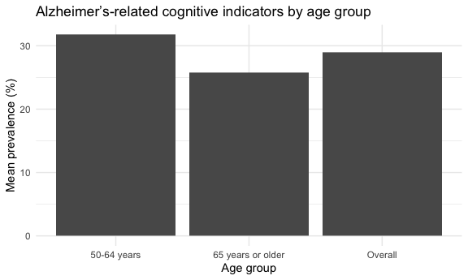
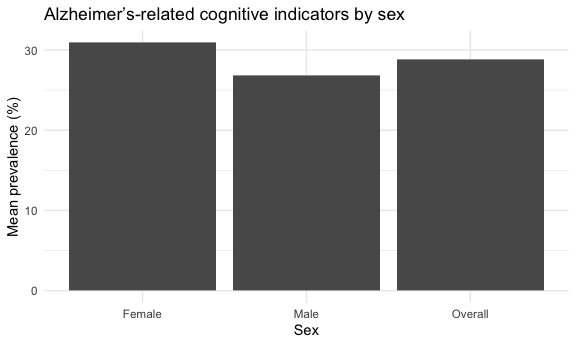
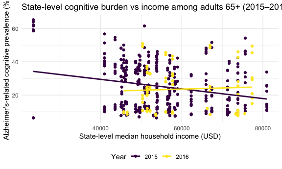
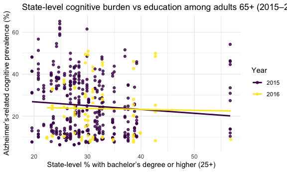

P8105_final_Alzheimei
================
bl3175, cw3747, lg3450, yw4662
2025-11-27

``` r
library(tidyverse)
```

    ## ── Attaching core tidyverse packages ──────────────────────── tidyverse 2.0.0 ──
    ## ✔ dplyr     1.1.4     ✔ readr     2.1.5
    ## ✔ forcats   1.0.0     ✔ stringr   1.5.1
    ## ✔ ggplot2   3.5.2     ✔ tibble    3.3.0
    ## ✔ lubridate 1.9.4     ✔ tidyr     1.3.1
    ## ✔ purrr     1.1.0     
    ## ── Conflicts ────────────────────────────────────────── tidyverse_conflicts() ──
    ## ✖ dplyr::filter() masks stats::filter()
    ## ✖ dplyr::lag()    masks stats::lag()
    ## ℹ Use the conflicted package (<http://conflicted.r-lib.org/>) to force all conflicts to become errors

``` r
library(patchwork)
library(scales)
```

    ## 
    ## Attaching package: 'scales'
    ## 
    ## The following object is masked from 'package:purrr':
    ## 
    ##     discard
    ## 
    ## The following object is masked from 'package:readr':
    ## 
    ##     col_factor

``` r
library(dplyr)


knitr::opts_chunk$set(
  fig.width = 6,
  fig.asp = .6,
  out.width = "90%"
)

theme_set(theme_minimal() + theme(legend.position = "bottom"))

options(
  ggplot2.continuous.colour = "viridis",
  ggplot2.continuous.fill = "viridis"
)

scale_colour_discrete = scale_colour_viridis_d
scale_fill_discrete = scale_fill_viridis_d
```

## Data Import

``` r
raw_az_data <- read.csv("./2015-2022 Alzheimer Data.csv") |>
  janitor::clean_names()
```

    ## Warning in scan(file = file, what = what, sep = sep, quote = quote, dec = dec,
    ## : EOF within quoted string

``` r
raw_az_data <- raw_az_data[-nrow(raw_az_data), ]
```

``` r
az_clean <- raw_az_data |>
  filter(
    !is.na(data_value),
    !is.na(year_start),
    !is.na(location_abbr)
  )
```

## Descriptive

``` r
az_clean |>
  summarise(
    n_rows = n(),
    n_states = n_distinct(location_abbr),
    year_min = min(year_start),
    year_max = max(year_start),
    n_topics = n_distinct(topic),
    n_questions = n_distinct(question)
  )
```

    ##   n_rows n_states year_min year_max n_topics n_questions
    ## 1  32616       59     2015     2022       39          39

We obtained data from the Centers for Disease Control and Prevention
(CDC) Alzheimer’s Disease and Healthy Aging Data, which are derived from
the Behavioral Risk Factor Surveillance System (BRFSS). After excluding
records with missing key identifiers, our analytic dataset contained
**32,616** observations from **59** states and territories, covering
survey years **2015–2022**. The dataset includes **39** distinct topics
and specific questions on health status and health-related behaviors
among middle-aged and older adults.

For this study, we focused on BRFSS items whose topic was labeled
**“cognitive decline”** or **“cognitive impairment”**. These items
capture self-reported cognitive problems among middle-aged and older
adults, and we treat them as Alzheimer’s-related cognitive indicators
rather than clinically confirmed Alzheimer’s disease.

## Data considering Alzheimei

``` r
library(stringr)

az_cog <- az_clean |>
  filter(
    str_detect(topic, regex("cognitive decline|cognitive impairment",
                            ignore_case = TRUE))
  )
```

### sex and age summary

``` r
az_cog_summary_base <- az_cog |>
  mutate(
    age_group = case_when(
      stratification_category1 == "Age Group" ~ stratification1,
      TRUE ~ "Overall"
    ),
    sex_group = case_when(
      stratification_category2 == "Sex" ~ stratification2,
      TRUE ~ "Overall"
    )
  )
```

### state × age × sex table

``` r
az_cog_state_age_sex <- az_cog_summary_base |>
  group_by(
    location_abbr, location_desc,
    age_group,
    sex_group
  ) |>
  summarise(
    n_obs = n(),
    mean_value = mean(data_value, na.rm = TRUE),
    .groups = "drop"
  ) |>
  arrange(desc(mean_value))

az_cog_state_age_sex
```

    ## # A tibble: 448 × 6
    ##    location_abbr location_desc age_group         sex_group n_obs mean_value
    ##    <chr>         <chr>         <chr>             <chr>     <int>      <dbl>
    ##  1 PR            Puerto Rico   50-64 years       Female        4       59.8
    ##  2 PR            Puerto Rico   50-64 years       Overall       8       58.2
    ##  3 PR            Puerto Rico   Overall           Male          4       54.5
    ##  4 PR            Puerto Rico   Overall           Overall       8       53.6
    ##  5 PR            Puerto Rico   Overall           Female        4       52.8
    ##  6 PR            Puerto Rico   65 years or older Overall       8       47.9
    ##  7 RI            Rhode Island  50-64 years       Female        4       47.2
    ##  8 OK            Oklahoma      50-64 years       Female        4       46.6
    ##  9 DE            Delaware      50-64 years       Female        4       46.1
    ## 10 PR            Puerto Rico   65 years or older Female        4       44.7
    ## # ℹ 438 more rows

### top 10 states (2015-2016)

``` r
az_cog_65_overall <- az_cog_summary_base |>
  filter(
    age_group == "65 years or older",
    sex_group == "Overall"
  )

nrow(az_cog_65_overall)
```

    ## [1] 609

``` r
sort(unique(az_cog_65_overall$year_start))
```

    ## [1] 2015 2016

The CDC Healthy Aging dataset covers survey years 2015–2022. For topics
coded as Cognitive Decline or Cognitive Impairment, data were only
available in 2015–2016; therefore, our Alzheimer’s-related analyses are
restricted to these two years.

``` r
library(ggplot2)

az_cog_65_overall <- az_cog_summary_base |>
  filter(
    age_group == "65 years or older",
    sex_group == "Overall"
  )

years_use <- c(2015, 2016)

az_cog_65_overall_15_16 <- az_cog_65_overall |>
  filter(year_start %in% years_use)
```

``` r
top10_state_15_16 <- az_cog_65_overall_15_16 |>
  group_by(location_abbr, location_desc) |>
  summarise(
    n_obs = n(),
    mean_15_16 = mean(data_value, na.rm = TRUE),
    .groups = "drop"
  ) |>
  arrange(desc(mean_15_16)) |>
  slice_head(n = 10)

top10_state_15_16
```

    ## # A tibble: 10 × 4
    ##    location_abbr location_desc  n_obs mean_15_16
    ##    <chr>         <chr>          <int>      <dbl>
    ##  1 PR            Puerto Rico        8       47.9
    ##  2 NRE           Northeast         30       33.6
    ##  3 OK            Oklahoma           8       31.5
    ##  4 MS            Mississippi       14       31.4
    ##  5 SOU           South             30       31.0
    ##  6 SD            South Dakota       8       30.9
    ##  7 MA            Massachusetts      5       30.8
    ##  8 AL            Alabama           14       30.2
    ##  9 AK            Alaska             7       29.8
    ## 10 SC            South Carolina    14       29.5

Using data from 2015–2016, we ranked states and regions by the mean
prevalence of Alzheimer’s-related cognitive indicators among adults aged
65 years and older (all sexes combined). The highest burden was observed
in Puerto Rico (mean prevalence 47.9%), which was notably higher than
any U.S. state or region. The Northeast region ranked second (33.6%),
followed by Oklahoma (31.5%), Mississippi (31.4%), and the South region
as a whole (31.0%). The remaining states in the top ten—South Dakota,
Massachusetts, Alabama, Alaska, and South Carolina—all had mean
prevalences around 30%. Overall, these results suggest substantial
geographic variation in self-reported cognitive problems among older
adults, with several Southern states and Puerto Rico showing
particularly high levels.

The Top 10 list for 2015–2016 is different from the earlier
state–age–sex table because they summarize different things. The
state–age–sex table ranks specific subgroups (for example, women aged
50–64 in Puerto Rico), so it shows where the highest subgroup
prevalences occur. In contrast, the 2015–2016 Top 10 is based only on
adults aged 65+ with sexes combined, giving one value per state. This
ranking reflects overall burden in older adults, not the maximum value
in any age–sex subgroup, and provides useful context for later
stratified analyses or adjustment for potential confounders such as age,
sex, or region.

## Distribution Difference

### prevelance ~ year

``` r
az_nat_65_overall <- az_cog_65_overall |>
  group_by(year = year_start) |>
  summarise(
    mean_prev = mean(data_value, na.rm = TRUE),
    sd_prev   = sd(data_value, na.rm = TRUE),
    .groups = "drop"
  )

az_nat_65_overall |>
  mutate(year = factor(year)) |>
  ggplot(aes(x = year, y = mean_prev)) +
  geom_col() +
  labs(
    x = "Year",
    y = "Mean prevalence (%)",
    title = "Alzheimer’s-related cognitive indicators among adults 65+, 2015–2016"
  )
```


At the national level, the mean prevalence of Alzheimer’s-related
cognitive indicators among adults aged 65+ was very similar in 2015
(26.0%) and 2016 (25.8%). The small difference of 0.2 percentage points
is well within the between-state variation and does not suggest any
clear change over this two-year period.

### prevelance ~ age

``` r
az_age_desc <- az_cog_summary_base |>
  group_by(age_group) |>
  summarise(
    n_obs      = n(),
    mean_value = mean(data_value, na.rm = TRUE),
    .groups = "drop"
  )

ggplot(az_age_desc,
       aes(x = age_group, y = mean_value)) +
  geom_col() +
  labs(
    x = "Age group",
    y = "Mean prevalence (%)",
    title = "Alzheimer’s-related cognitive indicators by age group"
  )
```



Across all cognitive items, the mean prevalence was about 31.8% among
adults aged 50–64 years and 25.8% among those aged 65 years or older.

### prevelance ~ sex

``` r
az_sex_desc <- az_cog_summary_base |>
  group_by(sex_group) |>
  summarise(
    n_obs      = n(),
    mean_value = mean(data_value, na.rm = TRUE),
    .groups = "drop"
  )

ggplot(az_sex_desc,
       aes(x = sex_group, y = mean_value)) +
  geom_col() +
  labs(
    x = "Sex",
    y = "Mean prevalence (%)",
    title = "Alzheimer’s-related cognitive indicators by sex"
  )
```



Across all states and cognitive items in 2015–2016, women had a higher
mean prevalence of Alzheimer’s-related cognitive indicators than men
(30.9% vs 26.8%), suggesting a consistently greater reported cognitive
burden among female respondents.

## Income Effects

### data import

``` r
inc15 <- read_csv("./median income-2015.csv", skip = 1) |>
  janitor::clean_names() |>
  transmute(
    year = 2015,
    state_name = geographic_area_name,
    median_income = as.numeric(median_income_dollars_estimate_households)
  )
```

    ## New names:
    ## Rows: 830 Columns: 123
    ## ── Column specification
    ## ──────────────────────────────────────────────────────── Delimiter: "," chr
    ## (83): Geography, Geographic Area Name, Total!!Estimate!!Households!!One ... dbl
    ## (39): Total!!Estimate!!Households, Total!!Margin of Error!!Households, M... lgl
    ## (1): ...123
    ## ℹ Use `spec()` to retrieve the full column specification for this data. ℹ
    ## Specify the column types or set `show_col_types = FALSE` to quiet this message.
    ## • `` -> `...123`

``` r
inc16 <- read_csv("./median income-2016.csv", skip = 1) |>
  janitor::clean_names() |>
  transmute(
    year = 2016,
    state_name = geographic_area_name,
    median_income = as.numeric(median_income_dollars_estimate_households)
  )
```

    ## New names:
    ## Rows: 831 Columns: 123
    ## ── Column specification
    ## ──────────────────────────────────────────────────────── Delimiter: "," chr
    ## (83): Geography, Geographic Area Name, Total!!Estimate!!Households!!One ... dbl
    ## (39): Total!!Estimate!!Households, Total!!Margin of Error!!Households, M... lgl
    ## (1): ...123
    ## ℹ Use `spec()` to retrieve the full column specification for this data. ℹ
    ## Specify the column types or set `show_col_types = FALSE` to quiet this message.
    ## • `` -> `...123`

``` r
income_state <- bind_rows(inc15, inc16)
```

### income by state

``` r
income_state_with_state <- income_state |>
  mutate(
    state = str_squish(str_extract(state_name, "[^,]+$")))

income_state_level <- income_state_with_state |>
  group_by(year, state) |>
  summarise(
    n_counties = n(),
    median_income_state = median(median_income, na.rm = TRUE),
    .groups = "drop"
  )

income_state_level <- income_state_with_state |>
  group_by(year, state) |>
  summarise(
    n_counties = n(),
    median_state = median(median_income, na.rm = TRUE),
    mean_state   = mean(median_income, na.rm = TRUE),
    .groups = "drop"
  )

income_state_level |> head(10)
```

    ## # A tibble: 10 × 5
    ##     year state                n_counties median_state mean_state
    ##    <dbl> <chr>                     <int>        <dbl>      <dbl>
    ##  1  2015 Alabama                      21       43553      46460.
    ##  2  2015 Alaska                        3       76427      76021.
    ##  3  2015 Arizona                      10       45195      44712.
    ##  4  2015 Arkansas                     11       46070      45950.
    ##  5  2015 California                   40       58954      62095.
    ##  6  2015 Colorado                     12       65960.     67584.
    ##  7  2015 Connecticut                   8       70144.     72854.
    ##  8  2015 Delaware                      3       56778      59366.
    ##  9  2015 District of Columbia          1       75628      75628 
    ## 10  2015 Florida                      40       49466.     49624.

As the Healthy Aging dataset is designed to monitor cognitive health in
older adults and Alzheimer’s disease primarily affects seniors, we
restricted our analytic sample to respondents aged 65+ years. For the
main state-level analysis, we used sex-grouped estimates labeled
“Overall” rather than sex-specific values so that each state–year
contributed a single prevalence estimate, simplifying the comparison
with state-level income and avoiding multiple correlated observations
per state.

``` r
state_vec <- unique(income_state_level$state)

az_cog_65_overall_state <- az_cog_65_overall |>
  filter(
    year_start %in% c(2015, 2016),
    sex_group == "Overall",
    location_desc %in% state_vec
  )

az_income <- az_cog_65_overall_state |>
  left_join(
    income_state_level,
    by = c("year_start" = "year",
           "location_desc" = "state")
  )
```

### relationship

``` r
ggplot(az_income,
       aes(x = median_state, y = data_value,
           color = factor(year_start))) +
  geom_point() +
  geom_smooth(method = "lm", se = FALSE) +
  labs(
    x = "State-level median household income (USD)",
    y = "Alzheimer’s-related cognitive prevalence (%)",
    color = "Year",
    title = "State-level cognitive burden vs income among adults 65+ (2015–2016)"
  )
```

    ## `geom_smooth()` using formula = 'y ~ x'



``` r
model_inc <- lm(
  data_value ~ median_state + factor(year_start),
  data = az_income
)

summary(model_inc)
```

    ## 
    ## Call:
    ## lm(formula = data_value ~ median_state + factor(year_start), 
    ##     data = az_income)
    ## 
    ## Residuals:
    ##     Min      1Q  Median      3Q     Max 
    ## -26.243 -12.189  -1.897   9.829  35.404 
    ## 
    ## Coefficients:
    ##                          Estimate Std. Error t value Pr(>|t|)    
    ## (Intercept)             3.805e+01  3.260e+00  11.672  < 2e-16 ***
    ## median_state           -2.354e-04  5.762e-05  -4.085 5.25e-05 ***
    ## factor(year_start)2016 -2.920e-01  1.723e+00  -0.169    0.866    
    ## ---
    ## Signif. codes:  0 '***' 0.001 '**' 0.01 '*' 0.05 '.' 0.1 ' ' 1
    ## 
    ## Residual standard error: 13.32 on 431 degrees of freedom
    ## Multiple R-squared:  0.03882,    Adjusted R-squared:  0.03436 
    ## F-statistic: 8.704 on 2 and 431 DF,  p-value: 0.0001968

In a linear regression of state-level Alzheimer’s-related cognitive
prevalence on median household income and survey year, higher income was
associated with lower cognitive burden. The estimated coefficient for
income was $\hat\beta_{\text{income}} = -2.35 \times 10^{-4}$, meaning
that a \$1000 increase in state median income was associated with about
a prevalence, and a \$10000 increase was associated with about a
prevalence among adults aged 65+. The coefficient for survey year (2016
vs 2015) was small ($\hat\beta = -0.29$), suggesting no clear overall
difference between the two years after accounting for income. However,
the model $R^2$ was only , indicating that income explains only a small
fraction of the large between-state variation in cognitive outcomes.

Although higher state-level income was statistically associated with
lower Alzheimer’s-related cognitive prevalence, income explained only a
small share of the between-state variability. Several factors may
contribute to this weak relationship. First, the analysis is ecological:
each observation is an aggregated state–year estimate, so large
within-state differences in income and cognitive health are not
captured, and any individual-level association is diluted. Second, both
cognitive burden and income are measured with error (self-reported
survey indicators and ACS estimates), and we further aggregated
county-level income up to the state level, which may introduce
additional noise. Third, we only examined two years (2015–2016), over
which variation in both income and prevalence is fairly modest. Finally,
many other state-level determinants—such as education, health care
access, demographic composition, and prevalence of vascular risk
factors—were not adjusted for, so income alone is unlikely to account
for the wide variation in cognitive outcomes across states.

## Education Effects

### data import

``` r
edu15_raw <- read_csv("./education2015.csv", skip = 1) |>
  janitor::clean_names()
```

    ## New names:
    ## Rows: 882 Columns: 771
    ## ── Column specification
    ## ──────────────────────────────────────────────────────── Delimiter: "," chr
    ## (424): Geography, Geographic Area Name, Total!!Margin of Error!!Populati... dbl
    ## (346): Total!!Estimate!!Population 18 to 24 years, Males!!Estimate!!Popu... lgl
    ## (1): ...771
    ## ℹ Use `spec()` to retrieve the full column specification for this data. ℹ
    ## Specify the column types or set `show_col_types = FALSE` to quiet this message.
    ## • `` -> `...771`

``` r
edu15_state <- edu15_raw |>
  filter(!str_detect(geographic_area_name, ","))

edu16_raw <- read_csv("./education2016.csv", skip = 1) |>
  janitor::clean_names()
```

    ## New names:
    ## Rows: 883 Columns: 771
    ## ── Column specification
    ## ──────────────────────────────────────────────────────── Delimiter: "," chr
    ## (428): Geography, Geographic Area Name, Total!!Margin of Error!!Populati... dbl
    ## (342): Total!!Estimate!!Population 18 to 24 years, Males!!Estimate!!Popu... lgl
    ## (1): ...771
    ## ℹ Use `spec()` to retrieve the full column specification for this data. ℹ
    ## Specify the column types or set `show_col_types = FALSE` to quiet this message.
    ## • `` -> `...771`

``` r
edu16_state <- edu16_raw |>
  filter(!str_detect(geographic_area_name, ","))
```

We used the proportion of adults aged 25 years and older with a
bachelor’s degree or higher as our main education indicator. This
measure is commonly reported in the ACS and captures individuals who
have completed at least a four-year college education, which is often
used as a marker of higher socioeconomic status and cognitive reserve in
the literature. Compared with more detailed education categories, using
“bachelor’s degree or higher” gives a simple, comparable summary of
educational attainment across states and years.

``` r
edu15_state_slim <- edu15_state |>
  transmute(
    year = 2015,
    state = geographic_area_name,
    educ_bach = as.numeric(percent_estimate_percent_bachelors_degree_or_higher)
  )

edu16_state_slim <- edu16_state |>
  transmute(
    year = 2016,
    state = geographic_area_name,
    educ_bach = as.numeric(percent_estimate_percent_bachelors_degree_or_higher)
  )

edu_state <- bind_rows(edu15_state_slim, edu16_state_slim)
```

``` r
az_edu <- az_cog_65_overall_state |>
  left_join(
    edu_state,
    by = c(
      "year_start" = "year",
      "location_desc" = "state"
    ))
```

### relationship analysis

``` r
ggplot(az_edu,
       aes(x = educ_bach,
           y = data_value,
           color = factor(year_start))) +
  geom_point(alpha = 0.8) +
  geom_smooth(method = "lm", se = FALSE) +
  labs(
    x = "State-level % with bachelor’s degree or higher (25+)",
    y = "Alzheimer’s-related cognitive prevalence (%)",
    color = "Year",
    title = "State-level cognitive burden vs education among adults 65+ (2015–2016)"
  ) +
  theme_minimal()
```

    ## `geom_smooth()` using formula = 'y ~ x'



``` r
model_edu <- 
  lm(
  data_value ~ educ_bach + factor(year_start),
  data = az_edu)

summary(model_edu)
```

    ## 
    ## Call:
    ## lm(formula = data_value ~ educ_bach + factor(year_start), data = az_edu)
    ## 
    ## Residuals:
    ##     Min      1Q  Median      3Q     Max 
    ## -19.554 -12.737  -2.077  10.376  39.346 
    ## 
    ## Coefficients:
    ##                        Estimate Std. Error t value Pr(>|t|)    
    ## (Intercept)            29.87275    2.95268  10.117   <2e-16 ***
    ## educ_bach              -0.16205    0.09617  -1.685   0.0927 .  
    ## factor(year_start)2016 -1.13543    1.73643  -0.654   0.5135    
    ## ---
    ## Signif. codes:  0 '***' 0.001 '**' 0.01 '*' 0.05 '.' 0.1 ' ' 1
    ## 
    ## Residual standard error: 13.53 on 431 degrees of freedom
    ## Multiple R-squared:  0.008142,   Adjusted R-squared:  0.003539 
    ## F-statistic: 1.769 on 2 and 431 DF,  p-value: 0.1717

In a linear regression of state-level Alzheimer’s-related cognitive
prevalence on the percentage of adults with a bachelor’s degree or
higher and survey year, higher education was associated with lower
cognitive burden. The estimated coefficient for education was
$\hat\beta_{\text{educ}} = -0.16$, meaning that a 1–percentage-point
increase in the share of adults 25 years and older with at least a
bachelor’s degree was associated with about a prevalence of
Alzheimer’s-related cognitive problems among adults aged 65+. A
10–percentage-point increase in educational attainment would correspond
to roughly a prevalence. However, this association was relatively weak
and not conventionally statistically significant (the approximate 95%
confidence interval for $\hat\beta_{\text{educ}}$ ranges from about
$-0.35$ to $0.03$). The coefficient for survey year (2016 vs 2015) was
small ($\hat\beta = -1.14$), suggesting no clear overall difference
between the two years after accounting for education. The model $R^2$
was only about , indicating that education and year together explain
only a small fraction of the large between-state variation in cognitive
outcomes.

Although states with higher levels of college education tended to have
slightly lower Alzheimer’s-related cognitive prevalence, the
relationship was weak and most of the between-state variability remained
unexplained. Several factors may help explain this. First, the analysis
is ecological: each data point is a state–year average, so big
within-state differences in education and cognitive health are smoothed
out, and any individual-level association is likely diluted. Second,
both education and cognitive burden come from survey-based estimates and
can be measured with error; on top of that, we aggregated county-level
education indicators to the state level, which probably adds extra
noise. Third, we only looked at two survey years (2015–2016), so there
is not much variation over time in either education or cognitive
outcomes. Finally, many other state-level factors—such as income, access
to health care, population structure, and the prevalence of vascular and
lifestyle risk factors—were not included in the model, so education
alone is unlikely to explain the wide differences in cognitive outcomes
across states.
